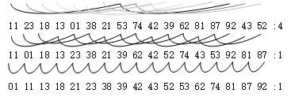

## 排序概述（计算机程序设计艺术第三卷）
---

### 插入排序
#### **思想**  
　　把每一个数据插入到其合适的位置，通过n次插入得到完整的排序。  介绍的插入排序方案都是稳定排序。

#### **直接插入排序**  
**方法**  
- 从待排序的队列中取数据A<sub>i</sub>，在排列好的数据R<sub>1</sub>中...R<sub>i-1</sub>中，找到记录R<sub>j</sub>使得R<sub>j-1</sub> <= A<sub>i</sub>(j > 1)且R<sub>j</sub> > A<sub>i</sub>。
- 将数据R<sub>j</sub>...R<sub>i-1</sub>向后移动一个位置。
- 将A<sub>i</sub>数据插入到R<sub>j</sub>位置。
- 循环上诉方法直至A<sub>n</sub>，使得所有的数据都完成排序。

如下方显示，采用直接才需的方式插入100、30、73、82

```
  ^100 : 30
  30 ^100: 73
  30 73 ^100: 82

  result : 30 73 82 100
```

**时间分析**

- 对于每个插入的数据来说，查找数据所以在的位置所需要的比较次数为O(n)。需要移动的数据量也为O(n)，因此对于每个操作而言，时间复杂度为O(n)。

- 对于整体来说，每个数据插入都需要经历上述的步骤，因此整体的时间复杂度为:
$$
  S = n * O(n) = O(n^2)
$$

 **空间复杂度**

- 可以在原有的空间上进行数据替换因此空间复杂度为O(1)


#### 优化一：二路插入排序

**思想**

直接插入排序算法可以通过二分查找来优化数据的查找，使得每次数据查找的时间消耗为O(log<sub>2</sub>n)。但是由于需要移动的数据平均接近于n/2。发现数据移动式该算法瓶颈后希望找到一个减少数据移动的方法。

**方案**

采用“两端烧蜡烛”的方法，在插入数据的时候判断插入的数据在队列的左侧或右侧插入哪边需要移动的数据量较少，则选择从那边进行数据插入。达到的效果是把数据移动的平均数变为n/3


#### 优化二：希尔排序

**思想**

​		**目前插入排序的瓶颈仍然在数据移动方面。**在常规的二路插入排序采用的是把数据先移动到空间的前方，随着新的数据插入将较大的数据“挤压”到后面。对于有些数据本身较大，在排序的一开始便参与排序中，则需要通过多次移动才能将其移动到排序队列的后端。

​		希尔排序采用**大步移动**的思想，先大步的进行排序给各个需要排序的树确定大致的位置，再按照粗略排序后的序列进行插入排序。

**方案**

- 首先根据输入的排序序列划分成多个步长h<sub>1</sub>...h<sub>k</sub>，h<sub>i</sub> > h<sub>i+1</sub>

- 取步长h<sub>i</sub>，根据步长h<sub>i</sub>对序列进行分组，对每组的数据进行插入排序。

- 最后h<sub>k</sub>的步长为1，整体对数组进行直接插入排序  

下面是一个例子介绍如何进行希尔排序。图中“：”左边是需要排列的数列，右侧为希尔排序的步长。在本例中步长为7、4、1，最终得到排序后的结构。 （第一排漏了，想象一下）



  **分析**

- 定理：一个“k有序”文件经过h-排序后仍然是“k有序”的[^1]。
  - 证明：首先需要阐述一个“桥梁”，对于两组数A<sub>1</sub>...A<sub>n</sub>,B<sub>1</sub>...B<sub>n</sub>,对于每个位置i，都有A<sub>i</sub><B<sub>i</sub>。则对A数组和B数组排序后，处在新位置的A<sub>p(1)</sub>...A<sub>p(i)</sub> 和 B<sub>f(n)</sub>...B<sub>f(n)</sub>，都有A<sub>p(i)</sub> < B<sub>f(i)</sub>(i 属于(1, n))。
  - 对于任意一个h-排序(h设置为5，k为7）前的数列 A<sub>i</sub>, A<sub>j+5</sub>,...,A<sub>j+5i</sub>，有A<sub>i+7</sub>, A<sub>i+5+7</sub>,...,A<sub>i+5i+7</sub>, 且其中每个元素A<sub>i+5k</sub> < A<sub>i+5k+7</sub>。在h-排序后，两个数列都会重新排序，排序后根据上述“桥梁”仍然有A<sub>i+5k</sub><A<sub>i+5k+7</sub>。把i，k任意取值，得到对于任意A<sub>t</sub>  < A<sub>t+7</sub>。 
-  时间复杂度：O(N<sup>7/6</sup>)，有可能达到O(n * log<sub>2</sub>n)，推理复杂略


[^1]: k有序：数列中每个步长为k的集合内部都是有序的，h-排序：h-排序后队列为h有序。

#### 优化三：列表插入排序

**思路：**

- 在优化一个算法时，首先考虑数据结构是否完全适合这个算法（*通用逻辑*)
-  优化的问题是**减少数据的移动操作**，数据移动时需要O(n<sup>2</sup>)，考虑使用可以任意移动的链表方式存储数据

**方案**

- 整体方案采用直接插入的方案，对数据进行排序。采用单向链表的方式存放数据，通过修改指针的方式对数据进行移动。

**分析**

- 时间复杂度方面：在查找数据方面时间复杂度为O(n<sup>2</sup>)；移动数据的时间复杂度为O(N)
- 空间复杂度方面：由于对于每个数据需要额外的空间存放指针，因此需要的额外空间为O(N)

#### 优化四：<font color=RED>树形插入</font>

**思想**

- 整合上述的优化方案，采用树形结构对数据进行组织。
- 通过树的形式，提供O(log<sub>2</sub>N * N)的查找复杂度；采用链表和顺序存储结合的组织结构，提供O(N)的数据移动复杂度，因此核心思路是减少数据移动开销

*Tips: 树形结构比较重要，这里只是介绍其设计思路*

#### 优化五：<font color=red>批量插入</font>

**思想**

- 需要插入一部分数据到排序好的队列中，插入的数据量为m(m>1)，排序好的数据量为N。按照直接插入排序的方案需要进行平均 $\frac{1}{2}N * m$次数据查找和数据移动；而采用批量插入则有可能通过一次扫描插入所有的数据，时间复杂度为$N$。

**方案**

- 首先对需要插入的数据进行排序
- 按照排序后的插入顺序，依次扫描原排序队列，通过一次扫描将数据插入到队列中。

*Tips: 该方案扩充后就是合并排序的思想，归并排序也是采用了批量插入的方案*


#### 优化六：地址计算排序

**思想**

- 采用先hash再排序的思想，类似于派发快递时先按照省份分类快递。按照数据范围将数据插入$N$个列表中，使每次数据插入需要查找和修改的数据规模减少为原来的$\frac{1}{N}$。（**减少数据规模**）

**方案**

- 首先把数据按照前几位划分成多个区域
- 在排序的时候先根据排序数的大小把数据分类到某个列表中
- 在列表中对数据进行插入排序


